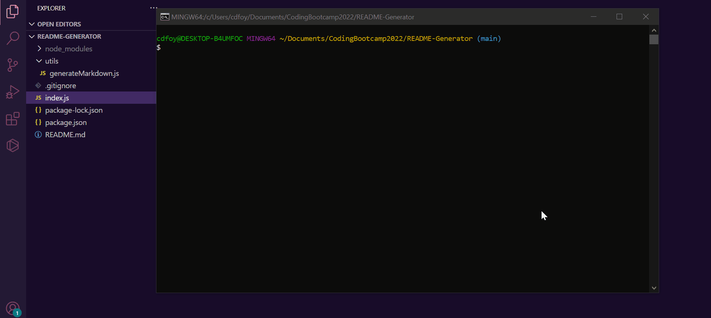

# README-Generator

  

  ## Description

  A high-quality README is important for open source GitHub projects. To expedite this time consuming task, use this command-line application to quickly and easily create and generate a README file. Now you can spend more time focusing on your project!
  
  ## Table of Contents
  
  - [Installation](#installation)
  - [Usage](#usage)
  - [Contributing](#contributing)
  - [Tests](#tests)
  - [Questions](#questions)
  - [License](#license)
  
  ## Installation
  
  - You will need to have node.js installed before running this application. 
  - Clone this repository
  - The Inquirer package is used to generate the README file from a user's input
  - Make sure you are in the directory of the cloned repository
  - Enter "npm install inquirer" in the terminal to install inquirer
  - Enter "node index.js" in your terminal
  - Follow the prompts to generate your README content
  
  ## Usage

  [Link to the README-Generator repository](https://github.com/cdfoye/README-Generator)

  The following gif demonstrates how to use this application:

  

  For a more detailed walkthrough, click the link below to watch a tutorial:

  [Link to tutorial video](https://drive.google.com/file/d/1_3uIyzlggbUAZaT_BVkYq7mDSAZAy2Si/view)
  
  ## Contributing

  If you would like to contribute to this project please reach out to me on Github or by email.
  
  ## Tests

  There are no test files in this project.

  ## Questions

  If you have any questions please visit my Github profile: [cdfoye](https://github.com/cdfoye)

  For additional questions you can email me at cdfoye@gmail.com
  
  ## License

  This application is covered under the MIT license